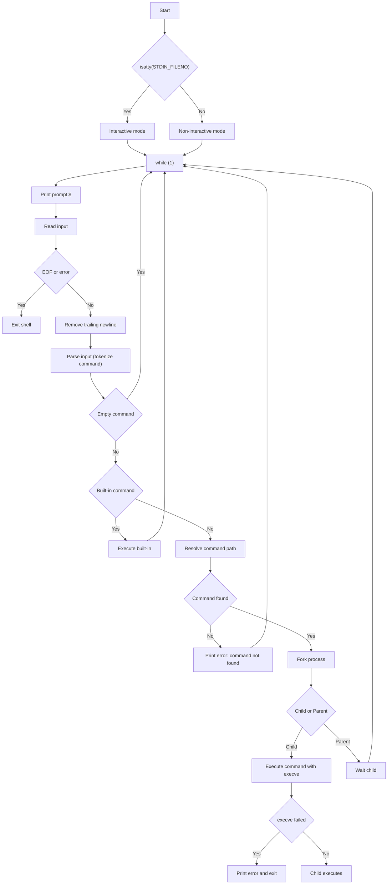

# 🐚 Simple Shell
**Language:** C

**Coding style:** Betty

**Platform:** Ubuntu 20.04

**Goal:** Minimal UNIX shell compliant with standard /bin/sh behavior

**Quality:** Memory-safe (no memory leaks)

---

## 📖 Table of Contents

    1. Introduction
    2. Project Objectives
    3. Flowchart
    4. Project Structure
    5. Compilation and Manual Page
    6. Usage Examples
    7. Features
    8. Constraints
    9. Sources and References

---

## 📌 Description
**Simple Shell** is a minimalist UNIX command interpreter written in **C**. 
It replicates basic behavior of a standard shell (`/bin/sh`). The shell: 
- Reads user input (interactive or from files/pipes)
- Parses input into commands and arguments
- Searches for executables in the `PATH` environment variable 
- Executes commands using `fork`, `execvev`, and `waitpid()`
- Implements built-ins like `env` and `exit`
- Handles errors and memory safely

---

## ✅ Project Objectives

**The main objectives of this project are to:**
- Implement a **minimal UNIX shell** in **C**
- Support both **interactive** and **non-interactive** modes
- Understand **process creation and management**
- Parse user input into executable commands
- Execute commands using low-level system calls
- Implement basic **built-in commands**
- Ensure **strict compliance with the Betty coding standard**
- Guarantee **safe memory management** (no leaks)

---

## 🔁 Flowchart
> This flowchart illustrates the shell’s main process: reading the command, parsing it, executing built-in, searching the PATH, and executing the command.


---

## 🧠 Allowed Functions and System Calls

This project strictly uses **only the functions and system calls authorized by the Holberton School project specification**.
No other functions, libraries, or system calls are used.

#### ✔️ Authorized functions

- All functions from `string.h`
- `access` *(man 2 access)*
- `chdir` *(man 2 chdir)*
- `close` *(man 2 close)*
- `closedir` *(man 3 closedir)*
- `execve` *(man 2 execve)*
- `exit` *(man 3 exit)*
- `_exit` *(man 2 _exit)*
- `fflush` *(man 3 fflush)*
- `fork` *(man 2 fork)*
- `free` *(man 3 free)*
- `getcwd` *(man 3 getcwd)*
- `getline` *(man 3 getline)*
- `getpid` *(man 2 getpid)*
- `isatty` *(man 3 isatty)*
- `kill` *(man 2 kill)*
- `malloc` *(man 3 malloc)*
- `open` *(man 2 open)*
- `opendir` *(man 3 opendir)*
- `perror` *(man 3 perror)*
- `printf` *(man 3 printf)*
- `fprintf` *(man 3 fprintf)*
- `vfprintf` *(man 3 vfprintf)*
- `sprintf` *(man 3 sprintf)*
- `putchar` *(man 3 putchar)*
- `read` *(man 2 read)*
- `readdir` *(man 3 readdir)*
- `signal` *(man 2 signal)*
- `stat` / `__xstat` *(man 2 stat)*
- `lstat` / `__lxstat` *(man 2 lstat)*
- `fstat` / `__fxstat` *(man 2 fstat)*
- `strtok` *(man 3 strtok)*
- `wait` *(man 2 wait)*
- `waitpid` *(man 2 waitpid)*
- `wait3` *(man 2 wait3)*
- `wait4` *(man 2 wait4)*
- `write` *(man 2 write)*

---

## ⚙️ Compilation

**Compile the shell using gcc:**
```bash
gcc -Wall -Werror -Wextra -pedantic -std=gnu89 *.c -o hsh
```
---

## ▶️ Usage
#### Interactive Mode

**Your shell should work properly in interactive mode:**
```bash
$ ./hsh
($) /bin/ls
AUTHORS  main.c  execute.c  shell.c
($) ls
AUTHORS  main.c  execute.c  shell.c
($) pwd
/home/user/simple_shell
($) env
# prints environment variables
($) exit
$
```
---

## ✅ Checks
- Work in group to create a **test suite**
- Cover both **standard cases** and **edge cases**
- Validate all mandatory requirements
- Follows the **project specification strictly**
- Clear separation: compilation / interactive / non-interactive
- Uses **exact examples** from the subject
- Professional, readable, and checker-friendly

All code must pass the Betty style checker and be verified with Valgrind to ensure there are no memory leaks.

---

## ✨ Features
- Executes commands entered by the user
- Supports **interactive** and **non-interactive** modes
- Resolves full paths using resolve_command_path()
- Executes commands via fork_and_execute()
- Searches for executables using the `PATH` environment variable
- Uses system calls such as `fork`, `execve`, and `wait`
- Built-in commands implemented:
    - `exit` – exits the shell
    - `env` – prints the current environment
- Handles errors gracefully (command not found, permission denied)
- Memory safe (frees all `malloc` allocations)

---

## 📂 Project Structure

```
.
├── main.c
├── shell.c
├── parse_args.c
├── execute.c
├── run_shell.c
├── process_line.c
├── building_cd.c
├── main.h
├── man_1_simple_shell
├── AUTHORS
└── README.md
```
---
## 📘 Manual Page

A manual page for the shell is provided.
```bash
man ./man_1_simple_shell
```
----

## 🚫 Limitations
- No pipes (`|`)
- No redirections (`>` or `<`)
- No command chaining (`;`, `&&`, `||`)
- Commands with quotes or complex arguments are not supported

---

## 🧪 Coding Style and Constraints
- Written in **C**
- Betty compliant
- Tested on Ubuntu 20.04
- Only allowed system calls are used
- No memory leaks (Valgrind tested)

---

## 📚 References
- Linux manual pages (`man fork`, `man execve`, `man wait`)
- GNU C Library documentation
- *Advanced Programming in the UNIX Environment* – W. Richard Stevens
- Holberton School

---

## 👨‍💻 Authors

Georgia Boulnois

Fabien Cousin
